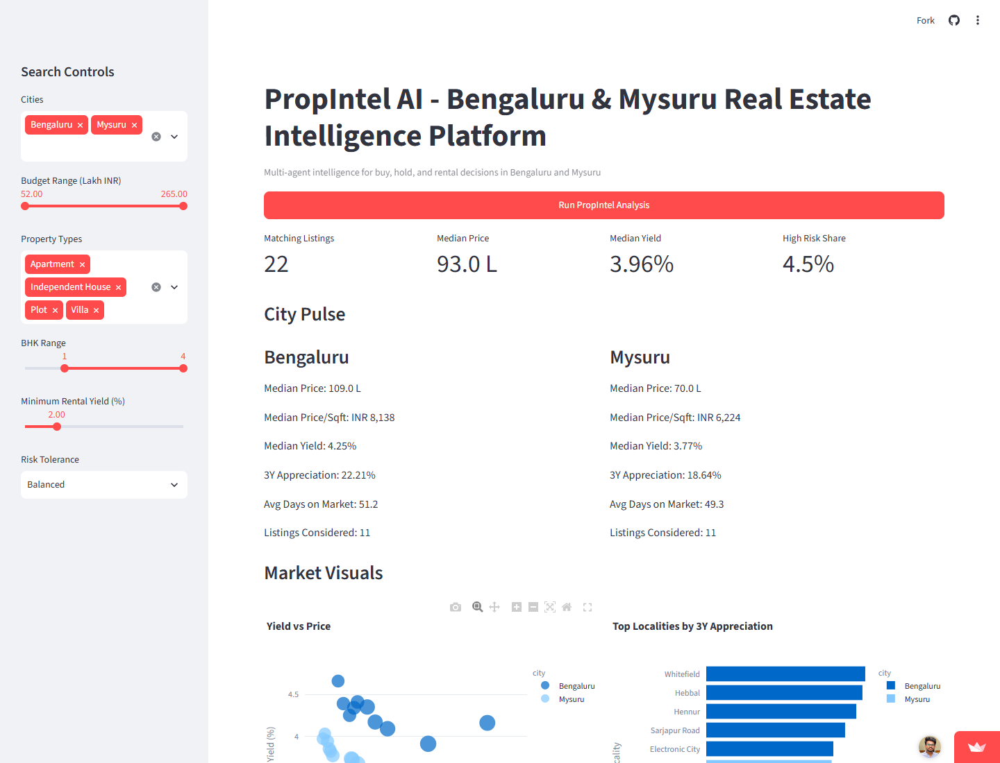

# PropIntel AI - Bengaluru & Mysuru Real Estate Intelligence Platform

Bengaluru and Mysuru real estate intelligence with multi-agent scoring.

## Live Demo

[Open the live Streamlit app](https://propintel-ai-bengaluru-mysuru-real-estate-intelligence-platfor.streamlit.app/)



## What It Does

PropIntel AI helps compare real estate opportunities across Bengaluru and Mysuru using local market data, filters, risk signals, and investment scoring. It is designed for quick buy, hold, and rental decision analysis without requiring external API keys.

## Features

- Multi-agent real estate intelligence workflow
- City, budget, property type, BHK, yield, and risk tolerance filters
- KPI summary for matching listings, median price, median rental yield, and risk exposure
- City-level market pulse for Bengaluru and Mysuru
- Interactive Plotly charts for yield, price, and locality appreciation
- Ranked property recommendations with PropIntel scoring bands
- Locality intelligence table for comparing micro-markets
- Filtered raw listings view for detailed inspection

## How It Works

PropIntel runs a lightweight multi-agent scoring pipeline over the included Bengaluru and Mysuru inventory dataset:

1. Data Agent loads and validates the property inventory.
2. Locality Scout Agent applies user filters and ranks localities.
3. Market Pulse Agent computes city-level market metrics.
4. Risk Watch Agent flags legal and climate risk exposure.
5. Investment Advisor Agent produces risk-adjusted property scores.

The Streamlit interface then displays the results across recommendations, locality intelligence, and filtered listings tabs.

## Tech Stack

- Python
- Streamlit
- Pandas
- Plotly

## Run Locally

Clone the repository:

```bash
git clone https://github.com/beingvicky/PropIntel-AI-Bengaluru-Mysuru-Real-Estate-Intelligence-Platform.git
cd PropIntel-AI-Bengaluru-Mysuru-Real-Estate-Intelligence-Platform
```

Install dependencies:

```bash
pip install -r requirements.txt
```

Start the app:

```bash
streamlit run propintel_ai_app.py
```

No external API key is required for the PropIntel app because it uses the included dataset at `data/bengaluru_mysuru_inventory.csv`.

## Project Structure

```text
.
|-- propintel_ai_app.py
|-- propintel_engine.py
|-- data/
|   `-- bengaluru_mysuru_inventory.csv
|-- assets/
|   `-- propintel-live-demo.png
|-- requirements.txt
`-- README.md
```

## Deployment

The app is deployed on Streamlit Community Cloud. Push changes to `main` and Streamlit will auto-redeploy from the connected GitHub repository.
